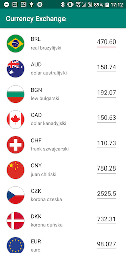
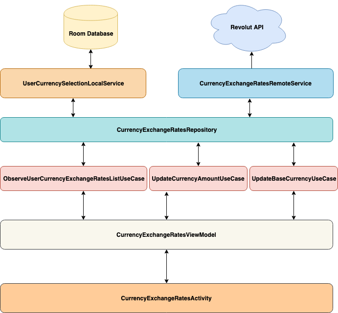

## Android Currency Exchange



## Overview

This is an Android mobile application project that:
* enables real-time currency exchange calculation feature for over 30 worldwide currencies
* provides real-time data about exchange rates from Revolut database endpoint

**DISCLAIMER:** This project cannot be treated as completed. It should demonstrate the core parts of the potential solution and make the best use of Android frameworks to create maintable, scalable and testable code.

## Architecture



Application is built on top of MVVM model with the following key layers:

### [Model] Repository pattern

A key part is CurrencyExchangesRatesRepository - an interface responsible for observing currency exchange rates and user's base currency actions. 

```kotlin
interface CurrencyExchangeRatesRepository {

    fun observeCurrencyExchangeRates(baseCurrency: Currency): Flowable<CurrencyExchangeRatesModel>

    fun observeUserCurrencySelection(): Flowable<UserCurrencySelectionModel>

    fun updateUserBaseCurrencySelection(newBaseCurrency: Currency): Completable

    fun updateUserCurrencyAmountSelection(newCurrencyAmount: BigDecimal): Completable
}
```

Repository "Dual" implementation is based on both remote and local services.

### [Model] Remote service with RxJava 2 and Retrofit 2

Remote service is responsible for currency rates polling to Revolut API (CurrencyExchangeRatesRemoteService). It's implementation is based on Retrofit 2 usage.

```kotlin
interface RevolutCurrencyExchangeRatesAPI {

    @GET("latest")
    fun getCurrencyRatesForBase(@Query("base") baseCurrency: Currency): Single<CurrencyExchangeRatesResponse>
}
```

### [Model] Local service with RxJava2 and Room

Local service is responsible for storing and retrieving user selections in the local database (UserCurrencySelectionLocalService). I took advantage of RxJava2 + Room combo, making Room's DAO easy to adapt with the RxJava approach:

```kotlin
@Dao
interface UserCurrencySelectionDao {

    @Query("SELECT * FROM user_currency_selection")
    fun observeUserCurrencyAmountChanges(): Flowable<UserCurrencySelectionEntity>

    @Insert(onConflict = OnConflictStrategy.REPLACE)
    fun insert(userCurrencySelectionEntity: UserCurrencySelectionEntity): Completable

    @Query("UPDATE user_currency_selection SET selected_currency_code = :baseCurrencyCode")
    fun updateUserBaseCurrency(baseCurrencyCode: String): Completable

    @Query("UPDATE user_currency_selection SET selected_currency_amount = :currencyAmount")
    fun updateUserCurrencyAmount(currencyAmount: String): Completable
}
```

I decided not to store any currency exchange rates locally as bringing any historical data is not a value to a user who wants to check real-time data.

### [Domain] Demonstrating application with use cases

In my opinion domain layer is the key part for having a good grasp of application features. 3 use cases that represent the business logic behind the currency rates exchange in the mobile application. Inspired by Clean Code (R.Martin).

Speaking about the most advanced use case (ObserveUserCurrencyExchangeRatesListChangesUseCase), I made use of another 2 significant Kotlin properties:
* **Extensions functions** where generally speaking, it's mainly used for improving code we don't control, but can also make our code more readable from high-level standpoint
* **Kotlin collections** with great variety of operators as well as chaining them into sequences to avoid intermediate allocations and make the code more effective.

Here is an example:

```kotlin
    private fun CurrencyExchangeRatesModel.mapToExchangeRateViewItemList(userCurrencySelectionModel: UserCurrencySelectionModel): List<ExchangeRateViewItemModel> =
        ratesMap
            .asSequence()
            .map { ExchangeRateViewItemModel(it.key, calculateCurrencyAmount(this, userCurrencySelectionModel, it.value)) }
            .plus(ExchangeRateViewItemModel(configuration.startBaseCurrency, calculateCurrencyAmount(this, userCurrencySelectionModel, BigDecimal("1.0"))))
            .sortedBy { it.currency.currencyCode }
            .toList()
```

### [ViewModel] ViewModel with Architecture Components

I made use of ViewModel - "lifecycle conscious" component that enables use-case-based data survive any lifecycle configuration changes. ViewModel is also responsible for use case lifecycle management.

```kotlin
...

    fun onCurrencyAmountChanged(newCurrencyAmount: BigDecimal) {
        userCurrencyAmountDisposable?.dispose()
        updateCurrencyAmountUseCase.run(newCurrencyAmount)
            .subscribe()
            .let { userCurrencyAmountDisposable = it }
    }

...

    override fun onCleared() {
        super.onCleared()
        userCurrencyAmountDisposable?.dispose()
        userBaseCurrencySelectionDisposable?.dispose()
        userCurrencyExchangeRatesListChangesDisposable?.dispose()
    }

```

### [View] Apply UI changes with RecyclerView and DiffUtils

To obtain the best possible user experience while dealing with currency exchange list, I used Recycler View. To ensure the most optimal Recycler View updates, I took advantage of DiffUtil capabilities. In order to both and maintain data consistency, I provided the following process:

* Keeping the the diff calculation process on a background thread - I put the logic inside the ViewModel

```kotlin
    fun onCalculateExchangeRateListsDifferences(oldList: List<ExchangeRateViewItemModel>, newList: List<ExchangeRateViewItemModel>): Single<DiffUtil.DiffResult> {
        return Single.just(DiffUtil.calculateDiff(ExchangeRateItemDiffList(oldList, newList)))
            .subscribeOn(Schedulers.io())
    }
```

* Return results to the main thread, update the backing data and finally notify the Recycler View Adapter

```kotlin
    fun updateItems(newExchangeRateViewItemModel: List<ExchangeRateViewItemModel>) {
        exchangeRateListsDifferenceCalculationDisposable?.dispose()
        onCalculateDiffList(exchangeRateViewItemModel, newExchangeRateViewItemModel)
            .observeOn(AndroidSchedulers.mainThread())
            .subscribe({
                exchangeRateViewItemModel.clear()
                exchangeRateViewItemModel.addAll(newExchangeRateViewItemModel)
                it.dispatchUpdatesTo(this@CurrencyExchangeListViewAdapter)}, {})
            .let { exchangeRateListsDifferenceCalculationDisposable = it }
    }
```

### [View] Load item flags images with Picasso

In order to provide handy image loading off the main thread, I made use of Picasso. All flags are stored locally with an application.

```kotlin
    Picasso.get()
        .load(context.resources.getIdentifier(currencyItem.currency.currencyCode.toLowerCase().plus(context.getString(R.string.flag_suffix)), context.getString(R.string.drawable_text), context.applicationInfo.packageName))
        .into(holder.currencyFlagImage)
```

### [View] UX-driven background process handling with sealed class

Asynchronous repository call with remote service usage can take a while or result with a problem - it's crucial to inform the user about the current state. In order to handle all of the states from the limited set, I made use of real Kotlin advantage that is a sealed class.

```kotlin
sealed class CurrencyExchangeListState {
    data class Loading(val message: String): CurrencyExchangeListState()
    data class Error(val throwable: Throwable): CurrencyExchangeListState()
    data class Update(val currencyExchangeList: List<ExchangeRateViewItemModel>): CurrencyExchangeListState()
}
```

With `CurrencyExchangeListState` I can encapsulate every possible state and ensure each possible situation is being handled, using Kotlin's `when`:

```kotlin
viewModel
    .observeExchangeListState(
        object: DisposableSubscriber<CurrencyExchangeListState>() {
            override fun onComplete() {}

            override fun onNext(state: CurrencyExchangeListState) {
                when (state) {
                    is CurrencyExchangeListState.Loading -> showLoading()
                    is CurrencyExchangeListState.Error -> showError(getString(R.string.default_error_text))
                    is CurrencyExchangeListState.Update -> updateItems(state.currencyExchangeList)
                }
            }

                    override fun onError(t: Throwable) {showError(getString(R.string.default_error_text))}
        }
    )
```

## Modularity and scalability with Dagger 2

To provide app modularity and scalability I built an application setup based on Dagger 2.

```kotlin
@Singleton
@Component(modules = [
    AndroidInjectionModule::class,
    RemoteServiceModule::class,
    LocalServiceModule::class,
    RepositoryModule::class,
    ActivityModule::class,
    CurrencyExchangeViewModelModule::class,
    CurrencyExchangeModule::class])
interface ApplicationComponent {
    ...
}
```

As the application is one-view, single feature application, there is only one @Singleton scope provided. Yet, for more advanced applications, there wouldn't be a big deal to rearrange an app structure so there will be more than one scope included.

## Test coverage

As Kent Beck tweeted during Christmas Eve 2016:

> Being proud of 100% test coverage is like being proud of reading every word in the newspaper. Some are more important than others.

My intention here to perform core tests and demonstrate its' variety with an appropriate tools/frameworks:
* Unit tests with MocKk
* Instrumentation tests with Android Core Testing

### Unit tests with MocKk

Pure Kotlin model and domain part of the code is **unit tested using MocKk** - a mocking library dedicated for Kotlin. I made use of mocking and stubbing capabilities to validate repository and use cases.

```kotlin
    @Test
    fun `given base currency and correct API answer when getting exchange rates returns currency exchange rates model`() {
        //given
        val baseCurrency = "EUR"
        val currencyExchangeRatesResponse =
            CurrencyExchangeRatesResponse(baseCurrency, emptyMap())
        every { revolutCurrencyExchangeRatesAPI.getCurrencyRatesForBase(any()) } returns Single.just(currencyExchangeRatesResponse)

        //when
        val testObserver = revolutCurrencyExchangeRatesRemoteService.getExchangeRatesForBase(Currency.getInstance(baseCurrency)).test()

        //then
        verify { revolutCurrencyExchangeRatesAPI.getCurrencyRatesForBase(Currency.getInstance(baseCurrency)) }
        testObserver
            .assertComplete()
            .assertValue(CurrencyExchangeRatesModel(Currency.getInstance(baseCurrency), emptyMap()))
            .assertNoErrors()
    }
```

For demonstrating purposes, I haven't delivered all possible tests including negative and corner case scenarios.

### Instrumentation tests 

I decided to make some **instrumentation tests** for the local service implementation based on Room database.

```kotlin
    @Before
    fun init() {
        //Initialize Room databaseUser
        databaseUser = Room.inMemoryDatabaseBuilder(
            InstrumentationRegistry.getInstrumentation().targetContext,
            RoomUserCurrencySelectionDatabase::class.java)
            .allowMainThreadQueries()
            .build()

        //Prepopulate first record
        databaseUser.userCurrencySelectionDao().insert(UserCurrencySelectionEntity(1, startBaseCurrency.currencyCode, startBaseCurrencyAmount)).blockingAwait()

        //Create a local service
        localService = RoomUserCurrencySelectionLocalService(databaseUser)
    }

    @After
    fun closeDb() {
        databaseUser.close()
    }
```

As a result, I was able to test my service on a Room instance using an Android device.

## Potential enhancements

Despite having strong app fundamentals, I can find many improvement areas for this application:
* Increasing the number of unit test including all potential scenarios
* Dagger scoping (if an application will have more just an one-view exchange rate feature list)
* Adding UI testing with Espresso (turning off animations in Developer Options is a must then!)
* Adding more verbose, Android-native UI error handling (retry possibilities with text clicks or swipe-to-refresh)